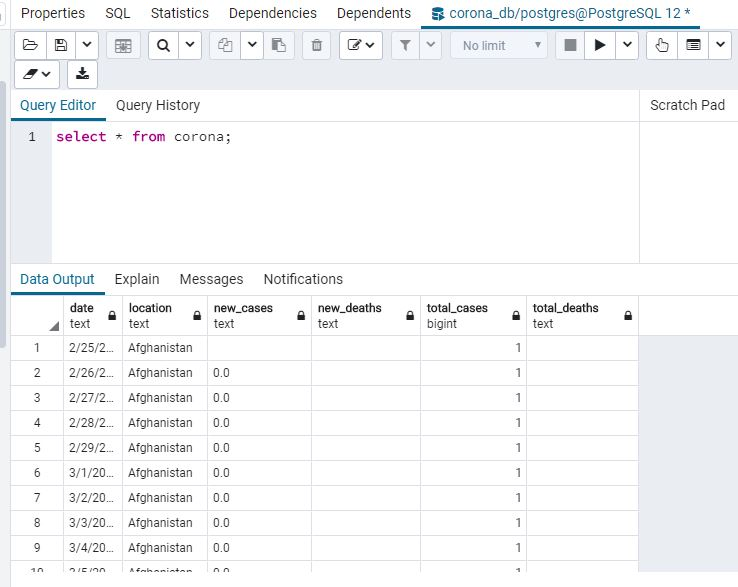

# ETL-Project
## Data Cleanup & Analysis

Our group performed ETL on the following datasets:

* 1). A dataset (full_data.csv) on Coronavirus case information in various countries (kaggle) 
  2). A dataset (airlines.csv) that contains a list of all airlines (kaggle)
  3). A dataset (airports.csv) that contains a list of all airports (kaggle)
  4). A dataset (routes.csv) that contains flight information (kaggle)

* The type of transformation needed for this data included:

  Airline Info ETL.pynb:

  - Data was cleaned, manipulated and joined (airlines.csv, airports.csv, and routes.csv)
  - Data was trimmed to only include necessary columns

  Corona ETL.pynb

  - Data was cleaned

* The type of final production database to load the data into:

 -Both sets of data were loaded into relational Postgres databases. A relational database was chosen because the data we received was highly structured and figured that Postgres would be the best option.

* The final tables or collections that will be used in the production database.

The names of the tables are: "airline_route_data" and "corona"

## Screenshots

This is a screenshot of the table that was created in Postgres with Covid-19 data as a result of the ETL project

